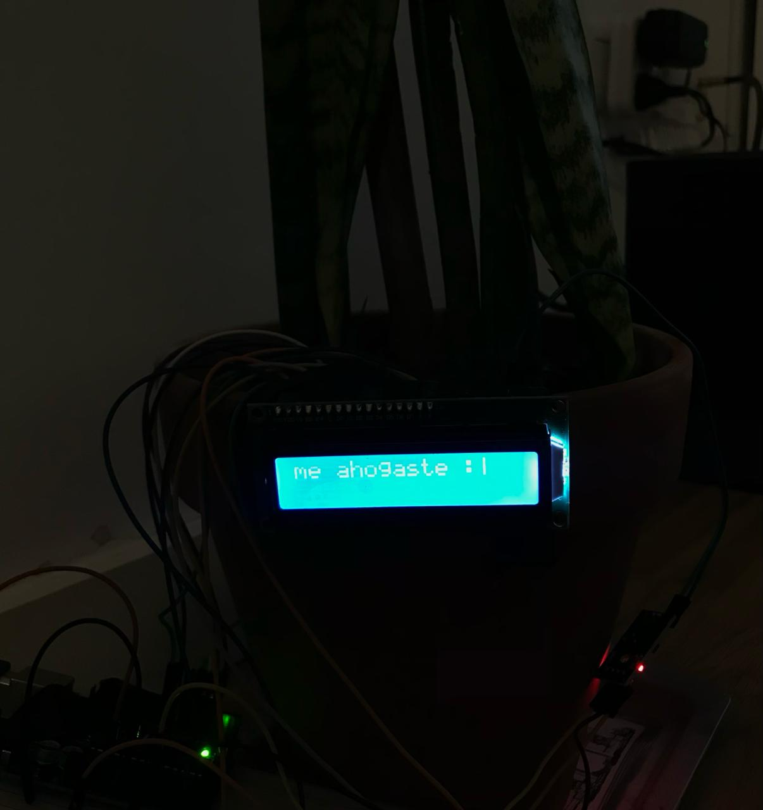
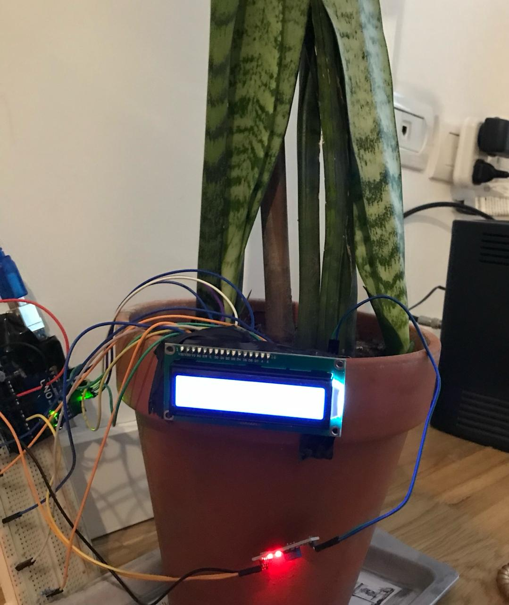

### Sensor suelo
En el archivo sensorsuelo, utilice un sensor de humedad en suelo HL-69 para moder mostrar en un display LCD la situciacion de la planta. Modifique el codigo teniendo en cuenta la humedad perfecta que requeria mi planta para no ahogarla(la busque por una pagina online) y tampoco que se seque. El display muestra tres estados posibles:
### "Estoy seca :("
En este caso nos indica que la planta debe ser regada.
### "Feliz :)"
En este caso la tierra esta a la humedad indicada.
### "Me ahogaste :|"
Indica que la tierra tiene exceso de agua.

